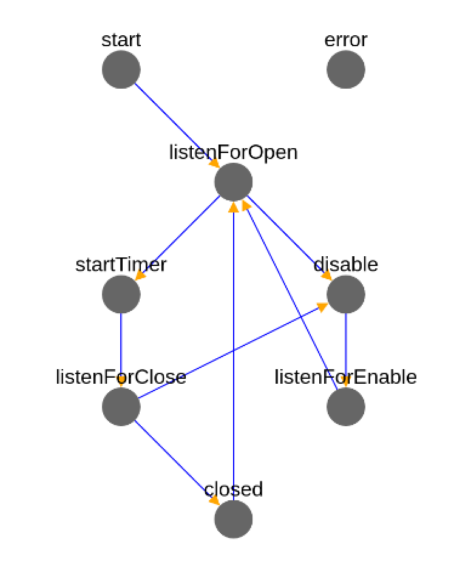
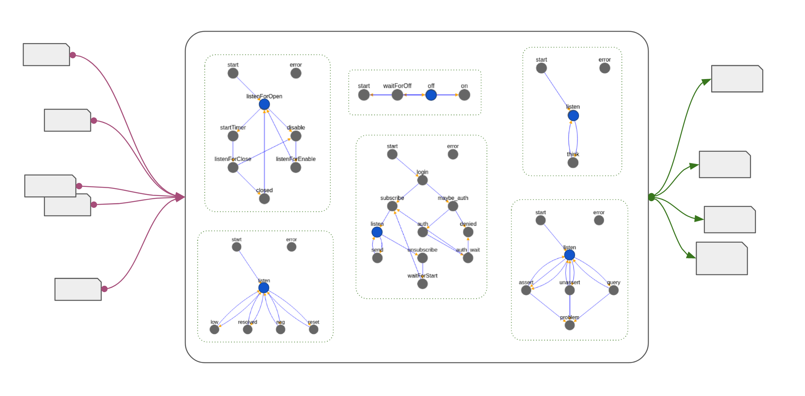
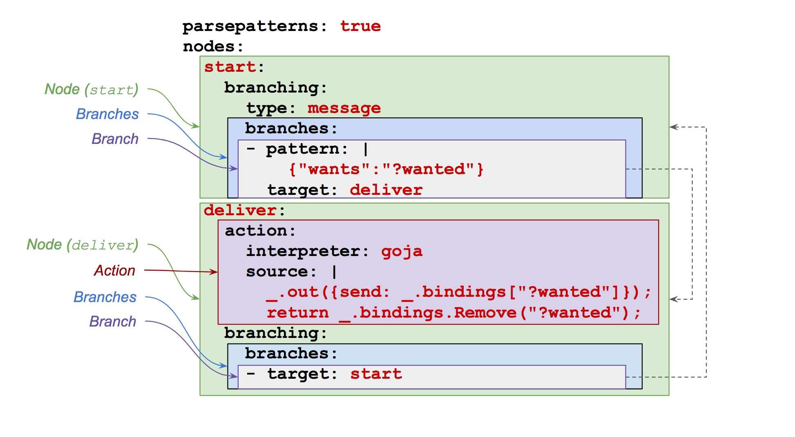

[](https://travis-ci.org/Comcast/sheens)
[](http://godoc.org/github.com/Comcast/sheens/core) 


# Messaging machines

<a href="specs/door.yaml"></a>

Sheens is an automation engine that hosts message-processing state
machines (also called "sheens").  These machines process and emit
messages efficiently and atomically.  The initial motivation was to
implement IoT-oriented home automations; however, Sheens has been
useful in other settings.

Sheens is easy to integrate via HTTP, WebSockets, MQTT, plain TCP, Go
or C applications, or via other glue.  For example, we have integrated
Sheens with several internal services, [AWS
IoT](https://aws.amazon.com/iot/), [Home
Assistant](https://home-assistant.io/), and other frameworks.

The structure and behavior of sheens are amenable to
[standardization](doc/rfc.md), and multiple
[implementations](https://github.com/Comcast/littlesheens) are
feasible and practical.  The Sheens engine is highly programmable.
Sheen-oriented tools (debuggers, visualizations, monitoring,
analyzers) are often easy to implement.




## License

This repo is licensed under [Apache License 2.0](LICENSE).

## Demo usage

To build, first install [Go](https://golang.org/doc/install).

Then:

```Shell
go get github.com/Comcast/sheens/...
cd $GOPATH/src/github.com/Comcast/sheens # Or equivalent
echo '{"double":1}' | msimple -s specs/double.yaml 
```

A bit fancier:

```Shell
mcrew -s specs -t :9000 &
cat cmd/mcrew/input.txt | nc localhost 9000
kill %%
```

See [`cmd/mcrew`](cmd/mcrew) for more discussion, and see the rest of
this README and [`doc/by-example.md`](doc/by-example.md) for a start
at documentation.

Applications will all use the [`core`](core) package (which has decent
[godoc](https://godoc.org/github.com/Comcast/sheens/core)).  If an
application wants a little help with containers of machines, then the
`crew` package might be a good start.  An application should provide
its own message transport (both in and out), and an application should
provide its own persistence.  For simple example, see
[`cmd/msimple`](cmd/msimple), which is a very simple single-machine
process.  The example [`cmd/mcrew`](cmd/mcrew) demonstrates some
additional functionality.


## Goals

This project attempts to provide automation gear that is

1. Simple
2. Robust and correct
3. Debuggable, testable
4. Efficient

IoT is a motivating application area.

Other objectives

1. Pluggable action interpreters.  Actions can be written in a
   language that's executed by pluggable components.
2. Transport-agnostic.  Input from and output to any sort of messaging
   services (e.g., HTTP, MQTT, CoAP).
3. Pluggable persistence.
4. Amenable to formal specification(s).
5. Feasible [alternative implementations](https://github.com/Comcast/littlesheens) in other
   languages.
6. Modest resource requirements.


## Design

A machine processes and emits messages.

1. A machine's state consists of the name of a node and the set of
   bindings (and a machine specification).  A machine's initial
   bindings are its parameters.
2. A machine's specification defines the structure and behavior of the
   machine.  (See [`specs`](specs) for some example
   specifications.)
3. A state transition is determined by pattern matching against either
   a pending message or current bindings.
4. Actions ideally just generate messages and return new bindings.  A
   good action has no side effects nor will it ever block on IO.
6. A collection of machines is called a _crew_. A crew is
   typically associated with a user account (or some agent).
7. Machines within a crew can send messages to all other machines
   in that crew or to a specific machine in that crew.
   (Intra-crew messaging is optionally provided by a _nanobus_ via
   a pluggable `Router`.)
8. Machines can send messages to any service if routed appropriately.
9. Action languages are pluggable.  Most examples here are based on
   [goja](https://github.com/dop251/goja), which is an ECMAScript
   implementation.

> "Transmit the message to the receiver; hope for an answer some day." 
>
> -[Talking Heads](https://play.google.com/music/preview/Tx4yvxloe6nc6ifnu77hd6n3ipe)

## Definitions



This section provides definitions for machines.  For an example-based
exposition, see this work-in-progress
[documentation](doc/by-example.md).

Given a _machine specification_ and some _initialization parameters_,
we can make a _machine_, which can perform _actions_ in response to
_messages_.

A machine specification consists of a map from _node names_ (just
strings) to _nodes_.  (See [`specs`](specs) for some example
specifications.)

A node consists of an optional _action_ and a required _branching_
specification that consists of a branching type, which is either
`message` or `bindings`, and a set of _branches_ to other nodes.

An action could be any function that accepts bindings and returns
bindings.  Ultimately, an action can (or should) only construct
messages and return a new set of bindings.  Every action has a
timeout, which is enforced.

Each branch consists of an optional _pattern_, optional _guard_, and a
required _target_, which is the name of a node in the machine
specification.

A pattern is a structure object that can include pattern variables.
(See below for more about pattern.)  A _guard_ is an optional
procedure that generates bindings (perhaps nil) from bindings.  If a
guard returns no bindings, then the branch isn't followed.

A machine consists of its _current state_: the name of the current
node, the current bindings, and a pointer to the machine's
specification.  A machine's initial parameters become the machine's
first bindings.

A _crew_ is a group of machines associated with some agent.


> To try to be happy is to try to build a machine with no other
> specification than that it shall run noiselessly.
>
> -[Robert Oppenheimer](https://en.wikiquote.org/wiki/Robert_Oppenheimer)


## Pattern matching

Transitions from one node to another are driven by pattern matching,
either against the current set of bindings or a pending message.

A _pattern_ is a map (perhaps with deep structure) that might contain
some strings that start with a `?`.  Example:

```Javascript
{"person": "homer",
 "likes": "?here",
 "at": {"type": "residence", "address": "?address"}}
```

A string that starts with a `?` is a _pattern variable_.

A message matched against a pattern results in zero or more sets of
variable bindings.

As an example, the pattern

```Javascript
{"a":{"b":"?x","c":"?y"},"d":"?y"}
```

matches

```Javascript
{"a":{"b":1,"c":2},"d":2}
```

with a set of bindings

```Javascript
[{"?x":1,"?y":2}]
```
When matching against a message, a map or set (array) value need not
be completely specified in the pattern.  This behavior is called
*partial matching*.  Examples:

> Pattern `{"a": 1, "b": "?x"}` matches `{"a": 1, "b": 2, "c": 3}` even though the pattern does
> not contain a key `"c"`.

> Pattern `{"a": 1, "b": ["?x"]}` matches `{"a": 1, "b": [2,3]}` with bindings `[{"?x": 2}, {"?x": 3}]`.
> Note the multiple bindings.

With partial matching, backtracking can occur.  Also you might get
more than one set of bindings.

An array is treated as a set, which can also trigger backtracking.
For example, the pattern

```Javascript
{"a":[{"b":"?x"}]}
```

matches

```Javascript
{"a":[{"b":1},{"b":2},{"c":3}]}
```

with the bindings

```Javascript
[{"?x":{"b":"1}},{"?x":{"b":"2}}]
```

For some more examples, see [`core/match.md`](core/match.md), which is
generated by test cases.


## Processing

A machine processes an input message by

1.  Obtaining the machine's current node based on the current node
    name and machine specification.

2.  If the current node has branching of type `message`, then the
    message is matched against each branch's pattern.  When there's a
    match, the branch's guard (if any) is executed based on the
    bindings that resulted from the match.  If the guard returns
    non-nil bindings, the machine's current node name is set to the
    branch's target, and the machine's current bindings is set to
    those (non-nil) bindings.  When a branch doesn't have a guard, the
    machine proceeds directly to the branch target.
   
    Branches are processed in the order given.
	
3.  If the current node has branching of type `bindings`, then the
    procedure above is executed except that the current bindings are
    used in place of the input message.  The process is execute until
    the branching are of type `message`, at which point the procedure
    above is executed.
	
When the machine arrives at a node that has an action, that action is
executed. Action execution results in a new set of bindings, which
will replace the current bindings.  (An action is given the current
bindings.)

A node with an action must have branching of type "bindings", so
processing can immediately proceed to the node's branches.  (This
behavior allows an action to have side effects, but we'd rather
actions _not_ have side effects.)

Ideally, actions can only emit messages.  In particular, in typical
use, an action can't even make an HTTP request!
	
(You might not have noticed that pattern matching during branch
evaluation can result in multiple sets of bindings ("bindingss").
What to do in that case?  One approach: If match results in more than
one set of bindings, each extra set of bindings results in the
creation of a new machine!  Alternately: Try each set of bindings in
(the arbitrary) order, and go with the first set of bindings that
works.  That's what the current implementations do, I think.


## Discussion

### No exceptions?

Retry-like functionality is specified just as any other control flow
is specified.  There are almost no exceptions.  (The only exception is
when an internal error occurs, and, even in that case, a setting
controls what happens next.
	
For example, the processor inject the error in bindings to allow for
standard, branching-based transitions based on the error.
Alternative, the machine could automatically transition to an error
node.  (That behavior would be the only possibility if the error
occured at a location that prevented branching-based error handling.)

### Simple state model	

A machine's state is independent from other machines' states.
Machines can run concurrently without any locking or synchronization.

A machine operates sequentially.  Therefore, there are no concurrent
state mutations (within a single process).

Virtuous actions have no side effects, and their processing is atomic.
Such an action can generate multiple outbound messages, but the
processor would only send that batch on if the action terminated
without error.  Using this behavior, an application can process a
message using multiple machines and that entire processing can be
atomic.
	
(Since action interpreters are pluggable, a system can of course
provide dangerous action interpreters, which can allow actions to do
IO and other unholy things.  Yes, you could have a Bash-based action
interpreter.)
	
### No internal blocking

A virtuous machine action does not block on IO.  Therefore machine
performance and resource consumption is can be relatively predictable.
	
(Again, since action interpreters are pluggable, a system can of course
provide dangerous action interpreters, which can allow actions to do
IO and other unholy things.)

### Future: Dispatch index

When a message is presented to a set of machines (which could contain
hundreds of machines), we'll want efficient dispatch to the subset of
machines that are waiting on `message` branching that will (likely)
match the message.  Efficient dispatch will likely require an index;
`util/index.go` heads that direction.  Other approaches are of course
possible.

### Tool-able
	
Machines are amenable to debugging using machine-oriented
debugging tools that provide the usual operations: reset state,
step through transitions, back up, set breakpoints, etc.

Since messages are message processors with exposed state, test tools
(see [`cmd/mexpect`](cmd/mexpect) for an example) are relatively easy
to write.  The `core` can be programmed functionality.  (There is no
"state" in `core`!)
	
### Atomic spec updating

If you want to update a machine specification (in a way that's
backward-compatible), you don't have to touch any user data.
Therefore, you can give many machines a new specification with a
single atomic swap (within a process).  See `core.Specter`.
	
### Timers and QoS
	
A system could have multiple timer services for different qualities of
timers.  For example, a _nanocron_ could implement timers with
goroutines (with various suitable limits). An external timer service
could provide durable timers.  Etc.
	
	
## Code of Conduct

We take our [code of conduct](CODE_OF_CONDUCT.md) seriously. Please
abide by it.

## Contributing

Please read our [contributing guide](CONTRIBUTING.md) for details on
how to contribute to our project.


## References

1. [The Actor Model](https://en.wikipedia.org/wiki/Actor_model)
1. [Guards in OCaml](http://www2.lib.uchicago.edu/keith/ocaml-class/pattern-matching.html)
1. [AWS Step Functions](https://aws.amazon.com/step-functions/) and [their state language](https://states-language.net/spec.html) 
1. Erlang's [`gen_statem`](http://erlang.org/doc/design_principles/statem.html)	
1. [Leslie Lamport](https://en.wikipedia.org/wiki/Leslie_Lamport) on [state machines](http://lamport.azurewebsites.net/pubs/state-machine.pdf)
1. The [Rulio](https://github.com/Comcast/rulio) rules engine
1. [Little Sheens](https://github.com/Comcast/littlesheens)
