# A tool to work with specs

Docs ToDo.

## Example

```Shell
cat demo.yaml | \
  spectool inlines -d . | \
  spectool macroexpand | \
  spectool addOrderedOutMessages -p 'lunch_' -s '00' -e done -d 3s \
     -m '[{"e":{"order":"beer"},"r":{"deliver":"beer"}},{"e":{"order":"queso"},"r":{"deliver":"queso"}},{"e":{"order":"tacos"},"r":{"deliver":"tacos"}}]' | \
  spectool addGenericCancelNode | \
  spectool addMessageBranches -P -p '{"ctl":"cancel"}' -t cancel | \
  spectool dot | \
  spectool mermaid | \
  spectool analyze |
  spectool yamltojson > \
  demo.json
```

The `analysis` function generates output like

```
errors: []
nodecount: 16
branches: 24
actions: 9
guards: 0
terminalnodes: []
orphans:
- lunch_00
- demo
emptytargets: []
missingtargets:
- there
- lunch_start
branchtargetvariables:
- '@from'
interpreters:
- ecmascript
```

If you have [Mermaid](https://mermaidjs.github.io/) installed, you can
render that output spec as an [SVG](demo.svg):

```Shell
./node_modules/.bin/mmdc -i spec.mermaid -o demo.svg
```



If you have [Graphviz]() instaled, you can render that output spec
with

```Shell
dot -Tpng spec.dot -o demo.png
```


