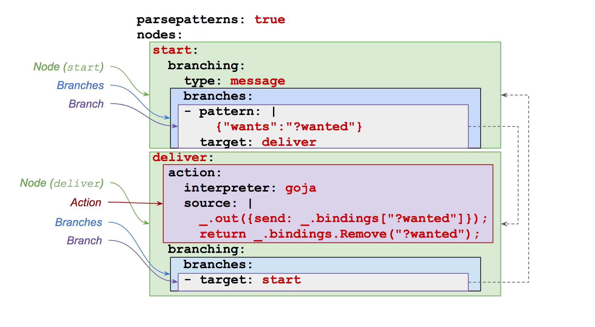

# Message Machines by Example

## Introduction

A _machine_, defined by a _specification_, consumes messages and emits
messages.  (Actually, a machine can perform any actions, but a machine
that only emits messages is much nicer to comtemplate.)

This document attempts to describe machines using examples and
narratives.  See the [README](../README.md) a more formal description.
In particular, [this section](../README.md#Definitions) semi-formally
specifies what a machine is, the
[this section](../README.md#Processing) describes machine behavior.
You can use the demo program [`mcrew`](../cmd/mcrew) to
experiment.

## Example 1: Simple reponse to an incoming messaging

### Narrative

Let's start with a very simple example.  The following machine
specification, which here is represented in YAML, emits a simple
message in reponse to a simple message.

```YAML
patternsyntax: json
nodes:
  start:
    branching:
      type: message
      branches:
      - pattern: |-
          {"wants":"?wanted"}
        target: deliver
  deliver:
    action:
      interpreter: goja
      source: |-
        _.out({send: _.bindings["?wanted"]});
        return _.bindings.Remove("?wanted");
    branching:
      branches:
      - target: start
```

Note that a specification could be rendered to and parsed from just
about any reasonable syntax.  Or better yet in some sitations,
presented and manipulated by (other) user interfaces.

Here's an annotated version of that specification.  Don't worry about
the labels yet.  We'll discuss each component below.



This machine has two nodes: `start` and `deliver`.  When the machine
is created, it begins at the `start` node (by default).

The `start` node has message-based branching (per `type: message`),
which means that a pending message, if any, is required for these
branches to be considered.  With message-based branching, the machine
will not advance if there is no pending message.  If there is a
pending message, then that message is matched against each branch's
pattern in the order.

For this node, there is only one branch, and it has the pattern
`{"wants":"?wanted"}`.  In this YAML specification, the pattern is
actually a string, but the specification has set `patternsyntax` to
`"json"`.  That setting means that the string is parsed as JSON.  The
pattern language itself is the same as
[Rulio's](https://github.com/Comcast/rulio/blob/master/doc/Manual.md#patterns). The
target for this branch is `deliver`, which is the name of the only
other node in the specification.

If the pending message matches the pattern, the machine transitions to
that target node with bindings that are extended by the result of the
pattern matching.  A machine's current state includes the name of the
current node and the current set of bindings.  When a machine performs
pattern matching, the machine's current bindings are used to populate
any variables in the pattern before the matching attempt.

If the pending message doesn't match the pattern, there are no other
branches to consider, and the processing stops.  The pending message
is still consumed in the sense that it's not held for future
consideration.

Say the pending message is `{"wants":"tacos"}`. When the machine
starts, there are no bindings, so the pattern `{"wants":"?wanted"}`
will match the pending message.  The result is a set of bindings
`{"?wanted":"tacos"}`.  (Actually the result is a set of exactly one
set of bindings.) The machine then transitions to the `deliver` node
with those bindings, which extended the previous empty bindings.

So the current state of the machine can be represented as a pair: node
name and bindings.

```
<"deliver", {"?wanted":"tacos"}>
```

The `deliver` node has an action.  This action will be executed by the
interpreter named `goja` per the `intepreter: goja` property.
[Goja](https://github.com/dop251/goja) is an ECMAScript interpreter.
The Goja runtime is populated with an object at `_`.  This object has
two important properties:

1. `_.out(x)`: A function adds the given argument to the list of
   messages that the action will emit (if action execution does not
   result in an error).  This function _does not block_.
2. `_.bindings`: The current set of bindings.  This value has methods
   `Remove(p1, p2, ... )` and `Extend(p, v)` to remove and add
   properties respectively.

The value of `_` also has some additional properties:

1. `_.gensym()`: A function that generates an random string (not a
   symbol!).
2. `_.log(x)`: A function to emit a log message.
3. `_.match(pattern, message, bindings)`: Utility to invoke pattern matching.


This example Goja interpreter also support libraries.  Here's an example:

```YAML
action:
  interpreter: goja
  source:
    requires:
	  - 'file://interpreters/goja/libs/time.js
    code: |-
      var spec = {daysOfWeek:[1,2,3,4,5], startTime:"19:00", stopTime:"22:00"};
      return isCurrent(spec) ? _.bindings : null;
      return _.bindings.Remove("?wanted","?n");
 ```

(A previous version supported a special operator `require()`, which
takes a string as an argument. That string should name a library
provided elsewhere (another topic) or represent a URL.  When the
specification is _compiled_, the `require` statements are expanded to
add the referenced code, which is then compiled (once). Many machines
can all use the same specification, so this library support is
relatively efficient.)

Note that no I/O is possible in one of these Goja actions.  More
generally, a Goja action cannot block.

As a developer, you can write or provide your own interpreter.  For
example, you could write an interpreter using Lua, Bash, Otto, OCaml,
or whatever.  An action interpreter is really a compiler and execution
function, so your thing can (pre)compile actions that are then
executed many times later.

Back to our example specification!

The "deliver" node's Goja action is

```Javascript
_.out({send: _.bindings["?wanted"]});
_.bindings.Remove("?wanted");
```

The first line ends up queuing the message `{"send":"tacos"}`.

The second line returns a set of bindings that results from removing
the binding for `"?wanted"` from the current bindings.  In this case,
the result is the empty set of bindings.

All actions return bindings that _replace_ the machine's current set
of bindings.  This behavior gives actions total control over a
machine's bindings.

If an action completes with out an error, all messages given to
`_.out()` are queued for processing.  (See the documentation TBD for
message processing.)  This approach means that an action that "sends"
-- say -- three messages and then hits an error will actually end up
not emitting any messages at all. Message output from an action is
atomic.

After the action is executed (and we'll assume without error), the
node's branches are considered.

The `deliver` node has bindings-based branching because the `branches`
type defaults to `"bindings"`.  With bindings-based branching, branch
patterns are matched against the machine's current bindings. No
pending message (if any) is considered with bindings-based branching.
So the machine can automatically process this node's branche(s).

Incidentally, a node with an action _must_ have message-based
branching. Otherwise, processing could leave a machine in an
intermediate state between the action execution and branch evaluation.
This limitation could probably be removed, but the cost appears to be
substantial (in terms of complexity).

The node has only one branch, and that branch has no pattern.  The
target of the branch is `"start"`; therefore, the machine transitions
to the `"start"` node.

At this point, the machine's state is 

```
<"deliver", {}>
```

The set of current bindings is empty because the action removed the
only binding (for `"?wanted"`) that we got during branch pattern
matching at the previous time we moved throught the `"start"` node.

If there is no pending message, the machine stops because the
`"start"` node has message-based branching.


### Summary

A few highlights:

1. A node either has message- or bindings-based branching.
1. A node with an action must have bindings-based branching.
1. The standard Goja actions cannot perform I/O or otherwise block.
1. Actions can queue messages.
1. An actions returns a set of bindings that replace the machine's current bindings.
1. Branches are evaluated in order.


## Example 2: A guard

In this example, we'll modify the specification above to make it
respond in a way that depends on a computed property.  There are
several ways to accomplish that task.  For this example, we'll use a
guard on a branch to do what we want.

This specification responses to messages like

```Javascript
{"wants":"tacos","count":2}
```

If the requested count is unreasonable, the machine will ignore the
request.  Otherwise, the machine will emit a message calling for
delivery of what was requested.

```YAML
patternsyntax: json
nodes:
  start:
    branching:
      type: message
      branches:
      - pattern: |-
          {"wants":"?wanted", "count":"?n"}
        target: consider
  consider:
    branching:
      branches:
      - guard:
          interpreter: goja
          source: |-
            var bs = _.bindings;
            if (3 < _.bindings["?n"]) { bs = null; }
            return bs;
        target: deliver
      - target: ignore
  deliver:
    action:
      interpreter: goja
      source: |-
        _.out({send: _.bindings["?wanted"], count: _.bindings["?n"]});
        return _.bindings.Remove("?wanted","?n");
    branching:
      branches:
      - target: start
  ignore:
    action:
      interpreter: goja
      source: |-
        return _.bindings.Remove("?wanted","?n");
    branching:
      branches:
      - target: start
```

This specification has four nodes. The `consider` node has two
branches, and the first branch has a `guard`.  This guard looks like
an action.  (And it can act like an action; however, it probably
shouldn't call `_.out()`. A future iteration of the codebase limit
guards more appropriately.)  If a branch has a guard, then that guard
is evaluated to see if the machine should transition to the branch's
target.  If the guard returns a non-null set of bindings, those
bindings replace the current bindings, and the machine transitions to
the target node.  Otherwise, the branch is not followed, and the next
ranch is considered.

The second branch in the `consider` node has no pattern (and no
guard), so it will always work if processing gets to that branch.  The
target is the `ignore` node, whose main job is to clean up the current
bindings and return the machine to the `start` node.

In this example, we clean up bindings twice and in the same manner:

```Javascript
return _.bindings.Remove("?wanted","?n");
```

In both cases, we just head back to start.

We could rewrite the specification to have a single clean-up node
(called `"reset"` instead of `"ignore"`):

```YAML
patternsyntax: json
nodes:
  start:
    branching:
      type: message
      branches:
      - pattern: |-
          {"wants":"?wanted", "count":"?n"}
        target: consider
  consider:
    branching:
      branches:
      - guard:
          interpreter: goja
          source: |-
            var bs = _.bindings;
            if (3 < _.bindings["?n"]) { bs = null; }
            return bs;
        target: deliver
      - target: reset
  deliver:
    action:
      interpreter: goja
      source: |-
        _.out({send: _.bindings["?wanted"], count: _.bindings["?n"]});
        return _.bindings;
    branching:
      branches:
      - target: reset
  reset:
    action:
      interpreter: goja
      source: |-
        return _.bindings.Remove("?wanted","?n");
    branching:
      branches:
      - target: start
```

Since an action has full control over the next set of bindings, we
could rewrite the specification to use an action instead of a guard.
Here is one variation on that theme:


```YAML
patternsyntax: json
nodes:
  start:
    branching:
      type: message
      branches:
      - pattern: |-
          {"wants":"?wanted", "count":"?n"}
        target: consider
  consider:
    action:
      interpreter: goja
      source: |-
        if (3 >= _.bindings["?n"]) { 
           _.out({send: _.bindings["?wanted"], count: _.bindings["?n"]});
        }
        return _.bindings.Remove("?wanted","?n");
    branching:
      branches:
      - target: start
```

This the example above, the action conditionally emits (so to speak) a
message.

Alternately, we could have the action just return bindings that
reflect the condition evaluation:

```YAML
patternsyntax: json
nodes:
  start:
    branching:
      type: message
      branches:
      - pattern: |-
          {"wants":"?wanted", "count":"?n"}
        target: consider
  consider:
    action:
      interpreter: goja
      source: |-
        return _.bindings.Extend("allowed": _.bindings["?n"] < 3);
    branching:
      branches:
      - pattern: |-
          {"allowed":true}
        target: deliver
      - target: reset
  deliver:
    action:
      interpreter: goja
      source: |-
        _.out({send: _.bindings["?wanted"], count: _.bindings["?n"]});
        return _.bindings;
    branching:
      branches:
      - target: reset
  reset:
    action:
      interpreter: goja
      source: |-
        return _.bindings.Remove("?wanted","?n","allowed");
    branching:
      branches:
      - target: start
```

Incidentally: note that the property `"allowed"` _isn't_
`"?allowed"`. Allowed isn't a logic variable that pattern matching
cares about.  We could have used `"?allowed"`, but then we'd need to
make sure that any pattern with that variable in it should really be
replaced by that binding.

## Example 3: Machine parameters

In example 2, we had a hard-coded constant for the maximum number of
items that we'd send.  We can make that value a parameter by
referencing the binding for `"max"`.  (Note that we'll bind `"max"`
and not `"?max"`, which makes it easier to reference the binding in
Javascript while keeping the binding away from pattern matching.  We
could use `"?max"` if we wanted to.

Only one line changes: The conditional in the `consider` node.q

```YAML
  ...
  consider:
    branching:
      branches:
      - guard:
          interpreter: goja
          source: |-
            var bs = _.bindings;
            if (_.bindings.max < _.bindings["?n"]) { bs = null; }
            return bs;
        target: deliver
      - target: reset
  ...
```

Whent the machine with this specification is created, an initial set
of bindings is created.  That initial set of bindings constitutes the
machine's parameters.  To make parameter requirements explicity, we
can add the following to the top of specification:


```YAML
paramspecs:
  max:
    doc: The maximum number of items we'll tolerate.
    primitiveType: int
...
```

Incidentally, you can add `doc` strings freely as above.  Of course,
you can also use YAML comments (stuff after a `#`).

## Example 4: HTTP requests and timers

So how does a machine actually get anything done in the real world?

As it stands, a machine can only consume and emit messages.  When
using the Goja interpreter, actions are non-blocking and can't do I/O.
So how to make -- say -- an HTTP request and get back a response?

The short answer: The process that hosts the machine needs to see to
it that certain messages that rerepresent HTTP requests result in HTTP
requests, with the responses return as messages submitted to the
machine.  

For exampe, the demo process `cmd/mcrew` includes internal services to
support timers and HTTP requests.  Alternatively, a process might
delegate this functionality to external services such as a pool of
HTTP requester or Elasticron.  Other possibilities, too, of course --
with interesting trade-offs and possible combinations.  For example,
perhaps there is an efficient but slightly less robust internal HTTP
and timer services, which are used when requests are marked with a
`qualityOfService: "internal"` property.  Much more to say on this
topic.

### Timers

The `cmd/mcrew` process has an internal service that responds to
messages like

```Javascript
{"makeTimer":{"in": "2s", "id": "chips", "message": {"likes":"queso"}}}
```

When triggered, that process will send the message `{"likes":"queso"}`
all the machines in the crew.  (Fancier routing is possible; see
[Routing](#routing) below.)

Here's an example use using the `mcrew` TCP API:

```
cat<<EOF | nc localhost 8081
# Make a machine with the "double" specification.
{"cop":{"add":{"m":{"id":"doubler","spec":{"name":"double"}}}}}
# Send a message that will run the "double" machine.
{"cop":{"process":{"message":{"to":{"mid":"doubler"},"double":1}}}}
EOF
```

Each line is input to `mcrew`.  These lines are _not_ messages to a
machine or crew.  Instead, they are messages to the container of a
crew (and, in the case of the `sleep` line, to an input processor in
front of that container).

### HTTP requests

The `cmd/mcrew` program has an internal service that processes
messages that are HTTP requests.  For an example use, here's an
excerpt of specification that shows a real use of that HTTP service:

```YAML
  requestSession:
    action:
      doc: Get the session cookie via login.
      interpreter: goja
      source: |-
        var r = {};
        r.id = "requestSession";
        r.url = "https://beta.icontrol.com/rest/icontrol/login";
        r.headers = {};
        r.headers["Accept"] = ["application/json"];
        r.headers["X-login"] = [_.bindings.login];
        r.headers["X-password"] = [_.bindings.password];
        r.headers["X-AppKey"] = [_.bindings.appkey];
        _.out({"to":"http","request":r});
        return _.bindings;
    branching:
      branches:
      - target: listenForCookie
  listenForCookie:
    branching:
      type: message
      branches:
      - pattern: {"from":"http","headers":{"Set-Cookie":"?cookie"}}
        target: getCookie
      - target: failed
```

Actual documentation TBD for this demo `http` machine, but the above
patterns give you an idea of the structures of the request and
response messages.


## Example 5: Message routing

A crew container can provide arbitrary message routing.  For example,
when `mcrew` receives a message that contains `"to":"turnstile"`, then
the container will send that message _only_ to a machine with id
`"turnstile"` (if such a machine exists in the crew). Using this
behavior, a sender can send a message to a specified machine.  By
default, a message submitted to a crew is forwarded to all machines in
the crew.

Fancier routing can be very interesting.  A container could route
certain messages to external services based on properties of those
messages.  For example, a timer request with a certain quality of
service designator might get routed to an external, robust timer
service.  Other timer requests could be routed to a local, native
timer machine.

_ToDo: Say more._


